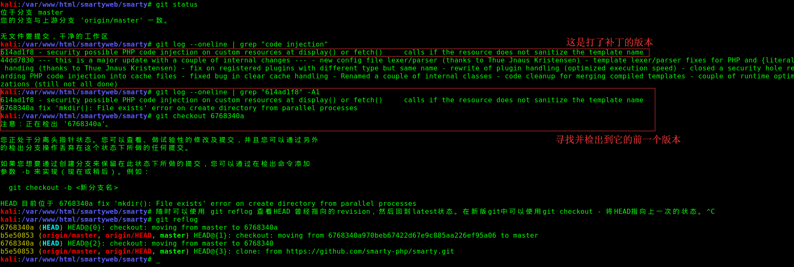
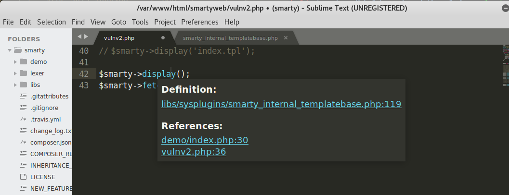

# 关于Smarty

关于Smarty需要知道（以下几点摘自 [Smarty 手册](https://www.smarty.net/docs/zh_CN/preface.tpl) ）：

- Smarty是一个PHP的模板引擎，提供让程序逻辑（PHP）与页面显示（HTML/CSS）代码分离的功能。 
- 在每个模板第一次被调用时，Smarty“编译”（简单地复制和转换）模板为PHP代码，然后编译后的代码将被一直使用。
- 虽然Smarty已经隔离了PHP代码，但如果你愿意，你还可以有相当多的方法来使用它。   
- Smarty并非一个MVC（Model-View-Controller 模型-视图-控制器），它仅是显示层，就是MVC中的V层（视图层）。 从这方面而言，Smarty可以很容易被整合到MVC中作为视图层。 许多非常著名的框架都整合了Smarty作为视图层 。
- 每天都有成千上万的独立访客访问Smarty网站，大多数都是开发者在阅读手册。许多著名的PHP项目在使用Smarty，如XOOPS CMS, CMS Made Simple , Tiki CMS/Groupware 和 X-Cart 等等。 
- Smarty并非唯一的，遵循*"分离显示逻辑和程序代码"*的引擎。 举个例子，Python有这相同理念的模板引擎，如 Django Templates 和 CheetahTemplate等。 

# 使用Smarty

`smarty/libs`  这个目录下的文件就是Smarty的库文件。库文件都是.php文件，开发者不应该编辑它们。

```bash
kali:/var/www/html/smartyweb# git clone https://github.com/php/php-src.git
kali:/var/www/html/smartyweb# ls smarty/libs/
Autoloader.php  debug.tpl  SmartyBC.class.php  sysplugins
bootstrap.php   plugins    Smarty.class.php
kali:/var/www/html/smartyweb# pwd
/var/www/html/smartyweb
```

我们需要创建文件index.tpl，然后供Smarty显示。

```bash
kali:/var/www/html/smartyweb# mkdir templates && touch templates/index.tpl
kali:/var/www/html/smartyweb# cat templates/index.tpl 
{* Smarty *}
Hello {$name}, welcome to Smarty!
```

现在，我们来修改index.php. 我们将创建Smarty的实例，给模板assign() 赋值变量，并且display()显示该模板文件 index.tpl。

```bash
kali:/var/www/html/smartyweb# cat index.php
<?php
//Smarty的SMARTY_DIR常量，是用来定义 Smarty库文件libs/目录的完整系统路径。这里手动指定。
define('SMARTY_DIR', './smarty/libs/');

//在PHP中实例化Smarty对象的方法：
require_once(SMARTY_DIR . 'Smarty.class.php');
$smarty = new Smarty();

//开始为你的程序配置Smarty了：
// Smarty可配置四个目录，默认名称分别是 templates/, templates_c/, configs/ 和 cache/。
$smarty->setTemplateDir('./templates/');
$smarty->setCompileDir('./templates_c/');
$smarty->setConfigDir('./configs/');
$smarty->setCacheDir('./cache/');

//给模板assign() 赋值变量
$smarty->assign('name','findneo');

//并且display()显示该模板文件 index.tpl
$smarty->display('index.tpl');

kali:/var/www/html/smartyweb# sudo /etc/init.d/apache2 start
kali:/var/www/html/smartyweb# curl http://192.168.149.128/smartyweb/
Hello findneo, welcome to Smarty!
```

注：本文为了方便将Smarty整个放在Web根目录下，实际上在生产环境这样做这是非常危险的。

# 复现


# 分析

首先检出到未打补丁的版本。



从 `3.1.32-dev-11 `  到  `3.1.32-dev-12` 的 [commit message](https://github.com/smarty-php/smarty/commit/614ad1f8b9b00086efc123e49b7bb8efbfa81b61) 如下：

> 21.7.2017
>
> security possible PHP code injection on custom resources at display() or fetch()  calls if the resource does not sanitize the template name

说明是自定义资源的时候，如果模板名称没有过滤，display函数和fetch函数就可能出现代码注入。

将Smarty整个目录在Sublime中打开，同时打开用于测试PHP文件，就可以看到已有函数定义的位置。

比如从下图可以看出display方法定义在 `/var/www/html/smartyweb/smarty/libs/sysplugins/smarty_internal_templatebase.php` ，可直接点击跟入。



display() 方法定义如下：

```php
/**
* displays a Smarty template
*
* @param string $template   the resource handle of the template file or template object
* @param mixed  $cache_id   cache id to be used with this template
* @param mixed  $compile_id compile id to be used with this template
* @param object $parent     next higher level of Smarty variables
*/
public function display($template = null, $cache_id = null, $compile_id = null, $parent = null)
{
    // display template
    $this->_execute($template, $cache_id, $compile_id, $parent, 1);
}
```

